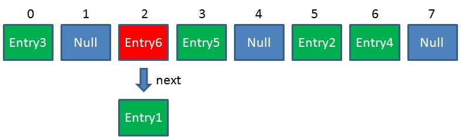

总览：hashmap采用了哈希表，线程不安全

底层：数组+链表&&数组+红黑树（1.8链表长度大于8）

HashMap数组每一个元素的初始值都是Null。

在大小达到0.75扩容

put方法

（put（"apple,0"））

假设：index = Hash（“apple”）=2

数组下标计算逻辑：

index＝key.key.hash()

index＝index&(table.length-1）

1.7采用头插法查到链表的最前面，并且头结点指向entry。1.8之后采用尾插法。

与运算只有都为1才为1，所以与运算取的数小于hashmap长度大小，且低位的长度和length的1的长度相同，这也是为什么长度要为2的幂

jdk4之前取余效率低，所以沿用至今

0101 0010 &  0000 1111（16-1）

得0010 （2）

put("banana",0)

假设：index = Hash（“banana”）=2

get方法

get(“apple”)

index = Hash（“apple”）=2

现根据key的哈希码查询key=2的元素

第一步，我们查看的是头节点Entry6，Entry6的Key是banana，显然不是我们要找的结果。

第二步，我们查看的是Next节点Entry1，Entry1的Key是apple，正是我们要找的结果。

之所以把Entry6放在头节点，是因为HashMap的发明者认为，后插入的Entry被查找的可能性更大。

HashMap的初始长度为16，每次扩展时长度必须是2的幂

之所以是16 是为了方便哈希算法

如何实现一个尽量均匀分布的Hash函数

index = HashCode（Key）& Length

采用位运算方式计算index

如何进行rehash，重新哈希。hash种子。

为什么1.7采用头插法，1.8之后采用尾插法：

1.7采用头插法效率高，尾插法需要遍历找到尾结点。但是头插法需要把新插入的entry的引用地址放到hash桶里面，这样get的时候才能从头到尾比较链表，找到正确的元素。(不是

扩容，头插法遍历链表的时候头插会颠倒链表顺序。(正确

hashmap懒加载：在new()的时候没有立刻创建，在put()的时候才会初始化对象。

为什么扩容要是2的幂：

因为计算数组下标的时候用的与长度-1运算。

什么时候扩容：

达到负载因子（默认0.75）并且要放入的哈希桶中没有数据才会扩容

如何扩容：

新建一个数组，再遍历原数组上的链表的每一个元素，重新哈希位与运算再put

计算比某个数小的最大二次幂

001\* \*\*\*\* 最后变成0011 1111再原来的数（001\*）减去变成后的数右移一位（0001 1111）得到

hashmap与hashtable的区别

线程安全的Map

ConcurrentHashMap:

* Hashtable的synchronized是针对整张Hash表的，即每次锁住整张表让线程独占，ConcurrentHashMap允许多个修改操作并发进行，其关键在于使用了锁分离技术
* 有些方法需要跨段，比如size()和containsValue()，它们可能需要锁定整个表而而不仅仅是某个段，这需要按顺序锁定所有段，操作完毕后，又按顺序释放所有段的锁
* 扩容：段内扩容（段内元素超过该段对应Entry数组长度的75%触发扩容，不会对整个Map进行扩容），插入前检测需不需要扩容，有效避免无效扩容

concurrenthashmap

1.7 里面有很多segment（继承了reentranlock），一个segment中包含一个hashentry数组。
